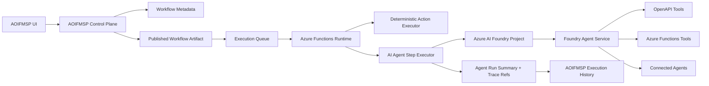

# AOIFMSP Azure AI Foundry Agent Extension

## Purpose

This document extends the AOIFMSP architecture and data model to support Azure AI Foundry Agent Service for two scenarios:

- AI-assisted workflow design inside the AOIFMSP visual designer
- Agent-backed runtime steps that can reason, retrieve knowledge, and use approved tools during workflow execution

This extension is designed to preserve AOIFMSP's core principles:

- AOIFMSP remains the workflow orchestrator of record
- Tenant isolation remains explicit and auditable
- Low-cost Azure primitives remain the default for the core platform
- AI is introduced as a governed capability, not as an uncontrolled side channel

## Current Azure Platform Assumptions

This design is based on Microsoft Learn documentation current as of March 12, 2026.

Relevant product facts reflected here:

- Azure AI Foundry Agent Service is GA and is the managed runtime for agents.
- Agent Service supports tools including OpenAPI and Azure Functions.
- Agent Service supports connected agents for multi-agent delegation.
- Agent Service supports tracing and Application Insights integration.
- Agent environments can use basic setup with Microsoft-managed agent state or standard setup with customer-owned resources.

## Design Goals

Add AI without breaking the deterministic workflow model.

Specifically:

- Let MSP operators describe desired automations in natural language and receive draft workflows.
- Let workflows include explicit `ai-agent` steps for summarization, extraction, routing, and guided decision support.
- Let agents call AOIFMSP tools in a controlled way through OpenAPI or Azure Functions.
- Keep approval gates and auditability around actions that affect client environments.
- Avoid forcing Cosmos DB or AI Search into the AOIFMSP core platform unless an MSP specifically chooses standard agent setup.

## Position in the Architecture

AOIFMSP should continue to own:

- Workflow definitions
- Publishing
- Execution orchestration
- Tenant and client scoping
- Connection binding
- Audit logs
- Approval workflows
- Execution summaries

Azure AI Foundry Agent Service should own:

- Agent runtime and reasoning
- Thread management
- Tool-call orchestration
- Agent tracing
- Agent-side file and vector state
- Agent safety and content filtering

This means AOIFMSP invokes agents as one kind of workflow step, but does not surrender end-to-end execution control to agents.

## Primary AI Use Cases

## Design-Time Use Cases

Recommended design-time agents:

- Workflow Drafting Agent: turns natural-language goals into draft workflow graphs
- Connector Mapping Agent: suggests which connector actions fit each business step
- Data Mapping Agent: proposes field mappings between PSA, RMM, documentation, and Graph actions
- Validation Agent: reviews drafts for missing bindings, risky loops, weak prompts, or non-idempotent branches
- Documentation Agent: explains the workflow and generates operational notes or runbooks

Design-time rules:

- Agents can create draft proposals, never publish directly
- Every proposed change should be surfaced as a visible patch or draft update
- AOIFMSP users stay in approval control of the published workflow

## Runtime Use Cases

Recommended runtime agents:

- Alert triage and summarization
- Ticket enrichment
- Classification of incoming email or webhook payloads
- Extraction of structured data from unstructured notes or documents
- Documentation search and synthesis
- Remediation-plan generation before a human approval gate
- Cross-system reasoning before choosing one of several deterministic downstream branches

Runtime rules:

- Runtime agents must appear as explicit workflow nodes
- Agent outputs should be structured whenever possible
- Agent-triggered tool use must be scoped by policy and logged

## Foundry Project Model

Recommended default mapping:

- One Foundry project per MSP per AOIFMSP environment
- `dev` AOIFMSP uses `dev` Foundry project
- `test` AOIFMSP uses `test` Foundry project
- `prod` AOIFMSP uses `prod` Foundry project

Rationale:

- Clean environment separation
- Easier cost tracking
- Easier model and prompt governance
- Easier trace correlation and operational ownership

A larger MSP can later split projects by geography or business unit, but the MVP should assume one project per MSP environment.

## Agent Setup Modes

Azure AI Foundry Agent Service currently offers setup choices that matter directly to AOIFMSP.

## Basic Setup

Characteristics:

- Lower operational complexity
- Agent state stored in Microsoft-managed resources
- Supports the same major agent features AOIFMSP needs for the MVP
- Best fit for fast adoption and lower platform management overhead

Recommended AOIFMSP use:

- Default MVP choice
- Best for design-time assistant workflows
- Best for early runtime use cases like summarization and extraction

## Standard Setup

Characteristics:

- Customer-owned Azure Storage, Cosmos DB, and AI Search for agent data
- Better fit for strict compliance, sovereignty, and network-isolation requirements
- Higher cost and provisioning complexity

Recommended AOIFMSP use:

- Optional upgrade path for MSPs with stricter governance requirements
- Better fit for retrieval-heavy agents or regulated workloads

## Standard Setup with BYO VNet

Characteristics:

- Same ownership and control benefits as standard setup
- Tighter network boundaries and reduced data-exfiltration exposure

Recommended AOIFMSP use:

- Enterprise or regulated MSP customers only
- Not recommended as the default AOIFMSP baseline

## Important Design Decision

AOIFMSP core storage remains unchanged regardless of Foundry mode.

- AOIFMSP Tables, Queues, Blobs, and Key Vault remain the system of record for workflow metadata and execution summaries.
- Foundry-owned thread and vector state remains in Foundry-managed resources for basic setup.
- Foundry-owned thread and vector state remains in dedicated customer resources for standard setup.
- AOIFMSP stores references to Foundry objects rather than duplicating complete conversation histories.

## Runtime Topology



## Tooling Strategy for Agents

Foundry agents should not call AOIFMSP internals arbitrarily. They should use explicit, approved tools.

Recommended tool types:

- OpenAPI tools for AOIFMSP APIs and connector-execution surfaces
- Azure Functions tools for strongly controlled backend actions or asynchronous tool execution
- Connected agents for specialized roles such as mapping, validation, or knowledge retrieval

## OpenAPI Tools

Best for:

- Deterministic AOIFMSP APIs
- Connector discovery
- Reading allowed metadata
- Controlled action submission APIs

Design rules:

- Each exposed operation must have a stable `operationId`
- Prefer managed identity when the target service supports it
- Use project connections for API-key or token-based integrations
- Expose only narrow, least-privilege APIs to agents

## Azure Functions Tools

Best for:

- Asynchronous actions
- Operations that already fit AOIFMSP's queue-based model
- Custom wrappers that enforce stronger validation or policy than raw OpenAPI exposure

Recommended pattern:

- Let the agent submit a request through the tool
- Let the function enqueue background work if needed
- Let AOIFMSP correlate the tool invocation to the current workflow execution

## Connected Agents

Best for:

- Multi-step drafting support in the designer
- Specialized runtime agents such as summarization, risk scoring, or policy review
- Separating prompt responsibilities for maintainability and traceability

AOIFMSP rule:

- Connected agents can assist an `ai-agent` step, but the containing AOIFMSP workflow still owns the outer execution boundary and audit trail

## AI-Assisted Workflow Design

## User Experience

The designer should support an AI sidebar or drafting panel where the operator can describe automation goals such as:

- "When Defender finds a high severity alert in a client tenant, summarize it, check documentation for known remediation, and create a PSA ticket."
- "Poll our RMM for offline servers, ignore maintenance windows, and open documentation plus ticketing actions when the outage lasts more than 15 minutes."

The Workflow Drafting Agent should return:

- Proposed trigger
- Proposed nodes and edges
- Recommended connector actions
- Required connections that are missing
- Assumptions and warnings
- Suggested approval gates

## Design-Time Safety

Design-time agents should operate in propose-only mode.

That means:

- They can create or modify workflow drafts
- They cannot publish workflows
- They cannot create or rotate secrets
- They cannot grant permissions in client tenants

## Agent-Backed Workflow Step Model

Add a new workflow node type: `ai-agent`

Suggested configuration fields:

- `agentId`
- `agentVersionId`
- `foundryProjectRef`
- `operatingMode`
- `inputTemplate`
- `outputSchema`
- `toolPolicyRef`
- `approvalPolicy`
- `timeoutSeconds`
- `maxRetries`
- `knowledgeScope`

## Operating Modes

Every agent-backed node should declare one of these modes:

- `suggest-only`: produce structured advice and no external side effects
- `act-with-tools`: allow approved tool usage within the step
- `approval-required`: allow the agent to prepare actions, but require human review before downstream execution proceeds

Recommended default:

- `suggest-only`

## Deterministic Boundaries

AOIFMSP should require structured outputs for runtime agent steps whenever possible.

Examples:

- Classification label
- Extracted ticket fields
- Severity score
- Proposed remediation plan
- Branch-selection result

The workflow engine should treat the agent output as data, not as autonomous workflow control outside the declared node contract.

## Execution Model for Agent Steps

Recommended flow:

1. AOIFMSP reaches an `ai-agent` node during workflow execution.
2. AOIFMSP resolves the tenant context, Foundry project, agent version, model policy, and allowed tools.
3. AOIFMSP writes the agent input payload to Blob Storage and creates an execution-step summary.
4. AOIFMSP invokes Foundry Agent Service.
5. Foundry manages thread state, tool orchestration, retries, and safety filtering.
6. AOIFMSP stores the structured result, status, trace references, and any approval requirements.
7. AOIFMSP resumes the workflow using normal queue-driven continuation.

For long-running agent steps:

- Use asynchronous queue continuation rather than holding one Function instance open unnecessarily
- Persist enough state to resume cleanly after retries

## Knowledge and Retrieval Strategy

Recommended phases:

Phase 1:

- Minimal retrieval
- Prompt-only design-time agents
- Runtime agents that work mostly from workflow input and tool outputs

Phase 2:

- Add documentation retrieval for MSP knowledge bases
- Use Foundry retrieval and vector features where the use case justifies them
- Keep the knowledge scope explicit per agent

Phase 3:

- Add client-specific retrieval scopes where governance requirements are satisfied
- Support stronger separation between MSP-global and client-specific knowledge

Important rule:

- Never let one client tenant's private documents become part of another client tenant's retrieval scope

## Security and Governance

## Tenant Isolation

Every agent invocation must carry:

- `mspTenantId`
- `clientTenantId` when applicable
- `workflowId`
- `workflowVersionId`
- `executionId`
- `executionStepId`

These identifiers should be used in:

- AOIFMSP execution records
- Foundry metadata tags where supported
- Blob paths and trace correlation

## Secret Handling

- Agent prompts and tool definitions must not embed raw secrets
- API-key-backed tools should use Foundry project connections or AOIFMSP-managed secret references
- AOIFMSP should continue using Key Vault for its own connection secrets
- Agents should never receive broad direct access to AOIFMSP secret stores

## Approval and Human Oversight

Use approval gates for:

- Security-sensitive actions
- Client-impacting changes
- User lifecycle actions
- Remediation that modifies production systems
- Cross-tenant administrative tasks

The agent may prepare a recommended action set, but AOIFMSP should own the approval record and release of downstream steps.

## Observability

AOIFMSP should correlate its own execution records with Foundry traces.

Persist these references in AOIFMSP for every agent run:

- `foundryProjectRef`
- `foundryAgentId`
- `foundryThreadId`
- `foundryRunId`
- `traceId`
- `modelDeploymentName`

The UI should let an operator open a workflow run and inspect:

- The AOIFMSP execution timeline
- The agent step input and structured output
- The linked Foundry run identifiers
- Any approval decisions or blocked tool calls

## Cost Model

Core AOIFMSP continues to favor low-cost services.

Agent-related cost drivers are separate and should be surfaced clearly:

- Model token usage
- Foundry project resources
- Tracing and Application Insights volume
- Standard setup resources such as Cosmos DB, Storage, and AI Search when enabled

Recommended defaults:

- Use smaller model deployments for drafting, classification, and summarization where acceptable
- Reserve larger models for complex planning or document-heavy tasks
- Keep agent traces and stored outputs on a retention policy
- Start with basic setup and move to standard only when governance needs justify it

## Data Model Extensions

These are additive to the existing AOIFMSP data model.

## Table: `FoundryProjects`

Purpose: per-MSP configuration of Azure AI Foundry project endpoints and setup mode.

Partition strategy:

- `PartitionKey = MSP#{mspTenantId}`
- `RowKey = FOUNDRY#{environmentName}`

Fields:

- `id`
- `mspTenantId`
- `environmentName`
- `displayName`
- `foundryProjectEndpoint`
- `foundryProjectName`
- `foundryProjectResourceId`
- `defaultModelDeployment`
- `setupMode`
- `status`
- `appInsightsResourceId`
- `storageResourceId`
- `cosmosResourceId`
- `searchResourceId`
- `createdAt`
- `createdBy`
- `updatedAt`
- `updatedBy`

## Table: `AIAgents`

Purpose: AOIFMSP catalog of design-time and runtime agents.

Partition strategy:

- `PartitionKey = MSP#{mspTenantId}`
- `RowKey = AGENT#{agentId}`

Fields:

- `id`
- `mspTenantId`
- `displayName`
- `agentType`
- `purpose`
- `foundryProjectRef`
- `foundryAgentId`
- `defaultModelDeployment`
- `latestVersionId`
- `instructionBlobPath`
- `toolPolicyBlobPath`
- `outputSchemaJson`
- `approvalMode`
- `status`
- `createdAt`
- `createdBy`
- `updatedAt`
- `updatedBy`

## Table: `AIAgentVersions`

Purpose: immutable prompt and policy versions for agents.

Partition strategy:

- `PartitionKey = MSP#{mspTenantId}|AGENT#{agentId}`
- `RowKey = VER#{agentVersionId}`

Fields:

- `id`
- `mspTenantId`
- `agentId`
- `agentVersionId`
- `versionLabel`
- `foundryAgentId`
- `modelDeploymentName`
- `instructionBlobPath`
- `toolDefinitionBlobPath`
- `outputSchemaJson`
- `safetyPolicyJson`
- `evaluationPolicyJson`
- `publishedAt`
- `publishedBy`
- `status`

## Table: `AIAgentRuns`

Purpose: summarized agent invocations from design-time sessions and workflow executions.

Partition strategy:

- Workflow-linked run: `PartitionKey = MSP#{mspTenantId}|WORKFLOW#{workflowId}`
- Design-only run: `PartitionKey = MSP#{mspTenantId}|DESIGN`
- `RowKey = AIRUN#{reverseTicks}#{aiAgentRunId}`

Fields:

- `id`
- `aiAgentRunId`
- `mspTenantId`
- `workflowId`
- `workflowVersionId`
- `executionId`
- `executionStepId`
- `agentId`
- `agentVersionId`
- `foundryProjectRef`
- `foundryAgentId`
- `foundryThreadId`
- `foundryRunId`
- `traceId`
- `modelDeploymentName`
- `operatingMode`
- `status`
- `toolCallsCount`
- `approvalState`
- `inputBlobPath`
- `outputBlobPath`
- `traceSummaryBlobPath`
- `startedAt`
- `completedAt`
- `durationMs`
- `startedByType`
- `startedById`

## Blob Containers

## Container: `ai-agent-definitions`

Purpose: AOIFMSP-owned prompt, policy, and evaluation assets.

Path pattern:

- `{mspTenantId}/{agentId}/{agentVersionId}/instructions.md`
- `{mspTenantId}/{agentId}/{agentVersionId}/tools.json`
- `{mspTenantId}/{agentId}/{agentVersionId}/evaluation-policy.json`

## Container: `ai-agent-runs`

Purpose: AOIFMSP summaries of prompts, structured outputs, and diagnostics.

Path pattern:

- `{mspTenantId}/{agentId}/{aiAgentRunId}/input.json`
- `{mspTenantId}/{agentId}/{aiAgentRunId}/output.json`
- `{mspTenantId}/{agentId}/{aiAgentRunId}/trace-summary.json`

## Queue: `ai-agent-step`

Purpose: asynchronous execution or resumption of an `ai-agent` workflow node.

Message shape:

```json
{
  "messageType": "ai-agent-step",
  "aiAgentRunId": "airun_01...",
  "executionId": "exec_01...",
  "executionStepId": "step_01...",
  "mspTenantId": "msp_01...",
  "workflowId": "wf_01...",
  "workflowVersionId": "wfv_01...",
  "clientTenantId": "client_01...",
  "agentId": "agent_01...",
  "agentVersionId": "aver_01...",
  "foundryProjectRef": "prod",
  "correlationId": "corr_01...",
  "inputBlobPath": "ai-agent-runs/.../input.json",
  "enqueuedAt": "2026-03-12T16:00:04Z"
}
```

## Workflow Node Shape

Recommended `ai-agent` node shape:

```json
{
  "id": "node_42",
  "type": "ai-agent",
  "label": "Summarize security incident",
  "agentId": "agent_01...",
  "agentVersionId": "aver_01...",
  "foundryProjectRef": "prod",
  "operatingMode": "suggest-only",
  "inputTemplate": {
    "incident": "{{variables.incident}}"
  },
  "outputSchema": {
    "type": "object"
  },
  "toolPolicyRef": "policy_01...",
  "approvalPolicy": {
    "required": true
  },
  "timeoutSeconds": 90,
  "maxRetries": 2
}
```

## Recommended MVP AI Scope

Recommended first release:

- One design-time drafting agent
- One validation/explainer design agent
- One runtime summarization/classification agent template
- `suggest-only` as the default operating mode
- Approval-gated execution for any agent step that can influence side effects
- Basic Foundry setup by default

Defer until later:

- Cross-client retrieval
- Autonomous remediation without human gates
- Large-scale client-specific vector indexing
- Multi-project sharding strategies
- Full evaluation dashboards inside AOIFMSP

## Implementation Sequence

Recommended order:

1. Add Foundry project registration and config to AOIFMSP admin
2. Add AOIFMSP agent catalog and versioned prompt storage
3. Add AI-assisted draft generation in the workflow designer
4. Add `ai-agent` runtime node support in the workflow engine
5. Add trace correlation, approval gates, and agent-run history views
6. Add retrieval and standard-setup support only when justified by specific MSP requirements

## Build Guidance

The most important boundary is this:

- AOIFMSP workflows stay deterministic and auditable at the orchestration level
- Foundry agents provide bounded intelligence inside explicit design-time and runtime surfaces

That gives AOIFMSP the benefits of AI assistance without turning the entire platform into an opaque agent system.


