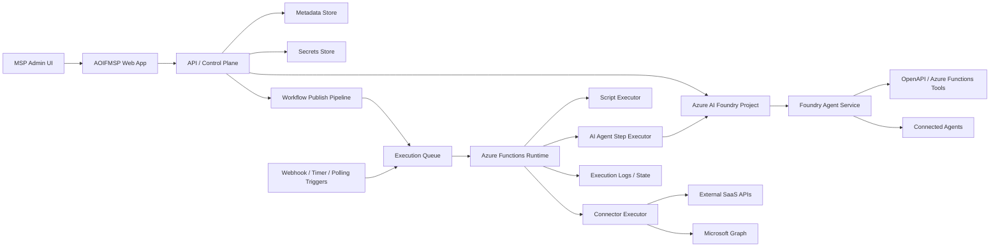

# AOIFMSP Architecture

## Purpose

AOIFMSP ("Automation of Integrations for Managed Service Providers") is a multi-tenant integration platform deployed into an MSP's Microsoft 365 tenant. It allows the MSP to:

- Register reusable API connections to MSP tooling such as PSA, RMM, documentation, security, billing, and other SaaS products.
- Register client-specific Microsoft Entra app registrations and permissions for accessing each client tenant through Microsoft Graph.
- Build visual workflows that connect external systems and Microsoft 365 data using actions generated from Swagger/OpenAPI definitions.
- Extend workflows with custom JavaScript blocks for logic that cannot be expressed by standard action blocks.
- Use Azure AI Foundry agents for AI-assisted workflow design and as explicit intelligent execution steps inside workflows.
- Provide core MSP-centric tenant and user management directly in the platform, using the same underlying action model that workflows can automate.
- Provide a unified technician workspace over PSA, RMM, documentation, workflows, and tenant administration.

The platform is designed to favor low-cost Azure services and avoid dedicated compute wherever practical.

## Product Goals

- Multi-tenant by design, with strong isolation between MSPs and between client tenants under each MSP.
- Metadata-driven integrations so new APIs can be onboarded with minimal custom backend code.
- Visual workflow authoring with a MakeCode-style block experience.
- Event-driven execution with reliable retries, auditability, and low idle cost.
- Support for both human-triggered and system-triggered automations.
- Add governed AI capabilities without moving orchestration or auditability outside AOIFMSP.
- Make common tenant and user administration available as first-class product features, not only as workflow building blocks.
- Give technicians one consolidated work surface instead of forcing repeated context switching across PSA, RMM, documentation, and admin tools.

## Architectural Principles

- Prefer serverless and consumption-based services.
- Separate control plane metadata from execution plane runtime data.
- Keep integration definitions declarative whenever possible.
- Treat credentials and tokens as high-sensitivity assets.
- Make tenant boundaries explicit in every record and runtime message.
- Design for replay, retry, and dead-letter handling from the start.
- Keep AOIFMSP as the orchestrator of record even when AI agents perform reasoning or tool use.
- Reuse one management action layer across direct UI features and workflow automation to avoid separate admin implementations.

## Core Domain Model

The platform revolves around these entities:

- MSP Tenant: the primary customer boundary where AOIFMSP is deployed.
- Client Tenant: a customer tenant managed by the MSP, typically with its own Graph app registration and consent.
- Connector: a normalized definition of an API provider derived from Swagger/OpenAPI.
- Connector Version: a specific imported API definition and generated action set.
- Connection: an authenticated instance of a connector, scoped either to the MSP or to a specific client tenant.
- Workflow: a visual automation definition composed of blocks and edges.
- Workflow Version: an immutable published snapshot used for execution.
- Management Operation: a first-class AOIFMSP action for tenant, user, license, role, and group administration that can be used directly in the UI or inside workflows.
- Trigger: a manual, scheduled, webhook, queue, or polling-based start mechanism.
- Action Block: a generated operation from a connector definition.
- Script Block: a custom JavaScript block executed within controlled limits.
- AI Agent Definition: an AOIFMSP-managed definition for a design-time or runtime agent hosted in Azure AI Foundry Agent Service.
- AI Agent Run: a summarized record of one invocation of a Foundry agent from AOIFMSP.
- Ticket Summary: a searchable PSA-derived work item used in the technician workspace.
- Device Summary: a searchable RMM-derived device record used in the technician workspace.
- Documentation Summary: a searchable documentation-system record used in the technician workspace.
- Technician Workspace Context: a unified view linking tickets, tenants, users, devices, documentation, alerts, and workflows.
- Execution: a runtime instance of a workflow version.
- Execution Step: the status, input, output, and error record for a single block execution.

## Tenant Model

### Isolation Strategy

AOIFMSP is logically multi-tenant. Every persisted entity includes:

- `mspTenantId`
- `clientTenantId` when applicable
- `resourceType`
- `resourceId`

The initial design uses shared Azure resources with strict logical partitioning rather than one resource group per MSP. This minimizes cost and operational overhead for the MVP.

### Boundary Rules

- MSP-scoped assets can be shared across that MSP's workflows.
- Client-scoped Graph connections and client-specific secrets must never be reused across other client tenants.
- GDAP-backed delegated operations must always execute in the intended customer context and never assume tenant-wide standing app-only privilege.
- Execution context always carries both MSP and client identifiers so actions can enforce authorization and routing.
- Audit records must show which MSP user or system actor initiated a change or run.
- Agent invocations must carry the same tenant and execution identifiers as deterministic workflow steps.

## Identity and Authentication

### AOIFMSP Application Identity

The solution is registered in the MSP's Microsoft Entra tenant and serves as the main control plane application.

Responsibilities:

- User sign-in for MSP administrators and operators.
- Administration of connectors, connections, workflows, and client tenant registrations.
- Token acquisition for AOIFMSP-owned APIs.

### Client Tenant Access

For each client tenant, the MSP creates or links an app registration and grants the required Microsoft Graph permissions.

Recommended approach:

- Store app registration metadata in AOIFMSP.
- Store secrets or certificates in Azure Key Vault.
- Prefer certificate credentials over client secrets where practical.
- Issue Graph tokens only at execution time, scoped to the specific client context.

### GDAP-Based Management Model

AOIFMSP should treat MSP-to-customer GDAP relationships as the primary authorization path for customer tenant management features.

Implications:

- Direct tenant and user management features should use partner delegated access through GDAP.
- AOIFMSP should expose those same management primitives as reusable workflow actions.
- The management UI and workflow engine should share the same underlying action contracts, validation rules, and audit model.

As of March 12, 2026, Microsoft documents GDAP as the least-privileged, time-bound administration model for partners, and documents that explicit multitenant application-only consent to a customer tenant is not supported for third-party developers using GDAP. In practice, that means AOIFMSP should default management operations to a multitenant app plus user plus OBO pattern, not broad customer-local app-only Graph permissions.

Design consequence:

- The customer-tenant app registration is primarily for AOIFMSP platform capabilities, customer-local integrations, webhook/subscription scenarios, or narrowly scoped platform permissions.
- It should not be treated as the default path for broad unattended administrative Graph access across customer tenants.
- Where unattended admin automation is needed, prefer the secure application model with GDAP-backed delegated/OBO access and explicit customer consent.

### External API Connections

Connections to PSA, RMM, documentation, or other vendor APIs may use:

- OAuth 2.0
- API keys
- Basic auth
- Vendor-specific header tokens

AOIFMSP should normalize authentication metadata but preserve provider-specific fields where needed.

## High-Level System Architecture

## Azure Service Selection

### Primary Services

- Azure Static Web Apps or an equivalent protected web tier: host the frontend. Development and test can prioritize lower cost; production must use a web pattern that supports Microsoft Entra auth, protected ingress, and secure backend connectivity.
- Azure Functions Consumption Plan or equivalent serverless plan: host APIs, trigger handlers, workflow execution, and background jobs. Production hosting must support the required private networking, identity, and diagnostics posture.
- Azure Storage Tables: store low-cost metadata and execution summaries where relational queries are limited.
- Azure Queue Storage: drive asynchronous workflow execution and retries.
- Azure Blob Storage: store imported Swagger files, workflow artifacts, large execution payloads, and logs.
- Azure Key Vault: store secrets, certificates, and encryption materials.
- Azure AI Foundry project and Agent Service: host governed design-time and runtime agents.
- Application Insights: centralized telemetry for APIs, workflow execution, and linked Foundry traces.

### Services to Avoid Initially

- Dedicated App Service Plans
- AKS
- Cosmos DB unless Table Storage limitations become blocking or an MSP explicitly chooses standard Foundry BYO setup
- Service Bus unless Queue Storage limitations become operationally significant
- SQL Database unless relational reporting/admin requirements justify it

### AI Service Posture

Azure AI Foundry Agent Service should be optional but first-class in AOIFMSP.

Recommended default:

- Basic Foundry setup for development, test, and lower-sensitivity production scenarios only after a security review

Upgrade path:

- Standard bring-your-own-resources setup when an MSP requires customer-owned Storage, Cosmos DB, AI Search, stricter data residency controls, tighter network governance, or privileged handling of sensitive customer data

Important boundary:

- AOIFMSP remains the system of record for workflow metadata, approvals, and execution summaries in all cases.
- Foundry owns agent runtime state such as threads, traces, and agent-side retrieval state.
- AOIFMSP stores references to Foundry projects, agents, threads, and runs rather than duplicating full conversation state.

### Production Security Baseline

AOIFMSP production environments should follow a stronger security profile than development and test.

Required production controls:

- Managed identity and Microsoft Entra-based service auth wherever supported
- Protected ingress for admin and technician surfaces
- Private endpoints or equivalent private connectivity for Storage, Key Vault, and Foundry where supported
- Explicit review before using Foundry basic setup for sensitive or privileged workloads
- Azure Policy, Defender for Cloud, and centralized diagnostics enabled by default

Detailed guidance lives in `docs/security-baseline.md`.

Operational readiness assets:

- `docs/security-readiness-checklist.md`
- `policy/azure/main.bicep`
## Suggested Deployment Topology

### Resource Groups

A single shared Azure subscription and resource group is sufficient for the MVP:

- `aoifmsp-shared-rg`

As the product matures, production can split into:

- `aoifmsp-web-rg`
- `aoifmsp-control-rg`
- `aoifmsp-data-rg`
- `aoifmsp-monitoring-rg`
- `aoifmsp-ai-rg`

### Environment Separation

Recommended environments:

- `dev`
- `test`
- `prod`

Each environment should have isolated storage accounts, function apps, Key Vault instances, and Foundry projects.

Production should additionally require a documented secure network topology, policy enforcement, and centralized diagnostics before go-live.

## Storage Design

### Azure Table Storage

Best fit for:

- MSP records
- Client tenant records
- Connector catalog metadata
- Connection metadata excluding secrets
- Workflow definitions and versions
- Execution summaries
- Audit events
- Foundry project, agent, and agent-run summary metadata

Suggested partitioning approach:

- Partition by `mspTenantId` for MSP-owned entities.
- Partition by `mspTenantId|clientTenantId` for client-scoped entities.
- Use denormalized records to support common UI queries without joins.

### Azure Blob Storage

Best fit for:

- Raw Swagger/OpenAPI documents
- Generated connector artifacts
- Large workflow JSON documents
- Execution payload snapshots
- Dead-letter diagnostic bundles
- AOIFMSP-owned agent prompts, policies, and summarized AI run payloads

### Azure Queue Storage

Best fit for:

- Workflow execution requests
- Step continuation messages
- Retry scheduling
- Polling trigger work items
- Asynchronous AI agent step execution and resume messages

## Connector Framework

### Connector Import

Connectors are imported from Swagger/OpenAPI documents.

Import pipeline:

1. Upload or reference a Swagger/OpenAPI definition.
2. Parse operations, schemas, parameters, security schemes, and pagination hints.
3. Generate normalized action metadata for the visual designer.
4. Store the raw definition and generated artifacts.
5. Allow admins to override labels, categories, auth mapping, and hidden fields.

### Generated Action Metadata

Each action definition should include:

- Stable action ID
- Connector and version reference
- Display name and description
- Input schema
- Output schema
- Auth requirements
- HTTP method and route template
- Pagination behavior if known
- Retry classification

### Connection Binding

A workflow block references an action definition plus a bound connection. This keeps connector metadata reusable across multiple workflows and tenants.

## Technician Workspace

AOIFMSP should provide a consolidated technician interface over the MSP's core operating systems:

- PSA
- RMM
- Documentation
- Tenant administration
- Workflows and runbooks

This is the day-to-day technician surface where tickets are managed and connected to customer tenants, users, devices, documentation, alerts, standards, and workflow execution.

### Technician Workspace Rules

- Tickets, tenants, devices, users, and alerts should be navigable as related context, not isolated modules.
- The technician should be able to launch approved workflows directly from ticket, tenant, device, or alert context.
- Documentation should appear in context, with the option to jump to the source system when deeper editing is needed.
- The workspace should preserve AOIFMSP's shared action model, audit model, and approval boundaries.

### Consolidated Tooling Model

The underlying source systems still own their authoritative data:

- PSA remains the source of truth for ticketing data
- RMM remains the source of truth for device and monitoring data
- Documentation platforms remain the source of truth for knowledge records

AOIFMSP stores lightweight searchable summaries, relationship indexes, and action hooks so technicians can work in one interface without losing access to system-specific depth.
## MSP-Centric Management Surface

AOIFMSP should provide core tenant and user management directly in the product, in addition to workflow authoring.

Recommended built-in management areas:

- Customer tenant overview and health
- Technician workspace with ticket, device, documentation, and workflow context
- Tenant groups and multi-tenant scoping
- Standards, drift, and management alerts
- User lifecycle operations such as create, update, disable, restore, and password-reset initiation
- License assignment and usage-location updates
- Role and group membership management where supported by delegated permissions
- Common Microsoft 365 administrative tasks surfaced as guided actions

Architectural rule:

- Every built-in management action should map to the same action abstraction used by workflows.
- The direct management UI is therefore a curated orchestration layer on top of AOIFMSP actions, not a separate admin subsystem.

Benefits:

- Faster delivery of high-value MSP features
- Consistent validation and audit behavior
- Easy conversion of repeatable admin tasks into automations later

### CIPP-Inspired Management Patterns

A mature MSP management surface should include several curated experiences beyond raw action execution.

Recommended patterns for AOIFMSP:

- Tenant home pages with health, recent admin activity, alert state, standards drift, and quick actions
- User lifecycle wizards for onboarding, offboarding, disable/restore, password-reset initiation, and license changes
- Tenant grouping for scoping actions, standards, and filtered operations across multiple customers
- Standards and baseline management so MSPs can define expected configuration and detect drift per tenant or tenant group
- Alerting tied to management posture, standards failures, risky conditions, and operational exceptions
- Quick portal jumpouts and context navigation for admins who need to move between AOIFMSP and native Microsoft portals
- Explicit cache refresh and permission refresh actions so operators can reconcile AOIFMSP state with live tenant state

These should still be implemented on top of the shared AOIFMSP action model rather than as a separate product silo.

### Standards and Drift Management

AOIFMSP should support a standards model for recurring customer-tenant configuration checks and optional remediation.

Recommended structure:

- Standards templates owned by the MSP
- Assignment of standards to one tenant or many tenants through tenant groups
- Drift results showing compliant, non-compliant, excluded, or unknown states
- Optional remediation actions, with approval gates where required

This is a strong fit for AOIFMSP because the same standards checks can be represented as deterministic actions and workflows when automation is desired.

### Management UX and State Freshness

Because customer management data changes outside AOIFMSP, the product should make data freshness explicit.

Recommended UX behaviors:

- Show last refresh time for tenant, user, and standards data
- Support targeted refresh for one tenant or one dataset instead of full global syncs by default
- Keep cached summary data for fast UX, but allow live read-through actions for sensitive or time-critical operations
- Separate cached state from authoritative execution actions so stale UI data does not silently change management behavior

## UI and Interaction Philosophy

AOIFMSP should follow a progressive, game-like UX model rather than a traditional expert-first enterprise admin UI.

Core requirements:

- Clean, friendly, intuitive interfaces in both Workflow Designer and Tenant Administration
- Progressive disclosure of complexity
- Contextual tools instead of permanently visible control overload
- Search-first and command-oriented interactions for speed
- Per-user input customization through an input action-map model
- Learn-in-product guidance that introduces capability in digestible chunks over time

Detailed guidance lives in `docs/ui-ux-principles.md`.
## Azure AI Foundry Agent Integration

AOIFMSP should use Azure AI Foundry Agent Service in two distinct ways:

- Design-time assistance inside the workflow designer
- Runtime `ai-agent` workflow steps for reasoning, extraction, summarization, and bounded tool use

### Design-Time AI Use Cases

Recommended design-time agents:

- Workflow Drafting Agent: turns natural-language goals into draft workflow graphs
- Connector Mapping Agent: suggests actions and field mappings across connectors
- Validation Agent: reviews workflows for missing bindings, risky loops, ambiguous prompts, or non-idempotent actions
- Documentation Agent: explains workflows and generates runbook-style notes

Design-time rule:

- Agents can propose or modify drafts, but they never publish directly to production

### Runtime AI Step Use Cases

Recommended runtime uses:

- Alert and email triage
- Ticket enrichment and summarization
- Unstructured data extraction
- Documentation lookup and synthesis
- Remediation-plan generation before a human approval gate
- Multi-system reasoning before deterministic downstream actions

Runtime rule:

- Agent-backed logic must appear as explicit workflow nodes, not hidden side effects

### Tool Strategy

Foundry agents should use explicit, approved tools rather than direct unrestricted backend access.

Preferred patterns:

- OpenAPI tools for AOIFMSP APIs, connector execution surfaces, and curated management-operation APIs
- Azure Functions tools for tightly controlled backend actions
- Connected agents for specialized mapping, validation, or retrieval roles

### Safety and Approval Model

Agent-backed steps should support these operating modes:

- `suggest-only`
- `act-with-tools`
- `approval-required`

Recommended default:

- `suggest-only`

Approval gates are recommended for:

- Security-sensitive actions
- Client-impacting remediation
- Privileged or cross-tenant operations

## Workflow Designer

### Authoring Model

The frontend presents a MakeCode-style block editor backed by a JSON workflow graph.

The graph should describe:

- Nodes
- Ports
- Edges
- Variable references
- Trigger configuration
- Block configuration
- Published version metadata
- AI draft provenance when a workflow was initially generated or modified by a design-time agent

### Block Types

- Trigger blocks
- Connector action blocks
- Condition blocks
- Loop blocks
- Data transform blocks
- Variable blocks
- JavaScript blocks
- AI agent blocks

### AI Agent Blocks

AI agent blocks call Azure AI Foundry agents as explicit workflow nodes.

Recommended configuration:

- Foundry project reference
- Agent definition and version reference
- Allowed tool policy
- Input prompt template
- Structured output schema
- Operating mode such as `suggest-only` or `approval-required`
- Timeout, retry, and approval policy

AI agent blocks should prefer structured JSON outputs so downstream nodes remain deterministic and testable.

### JavaScript Blocks

Custom JavaScript is supported for advanced logic but should run within controlled limits.

Guardrails:

- Time limit per script execution
- Memory and payload limits
- No unrestricted network access from script code
- Access only to explicitly provided inputs and helper utilities
- Structured logging and captured exceptions

For the MVP, JavaScript execution can be implemented as a constrained server-side function host rather than a separate dedicated sandbox service.

## Workflow Execution Runtime

### Execution Pattern

Publishing a workflow produces an immutable execution artifact. Runtime executions operate only on published versions.

Execution flow:

1. A trigger creates an execution request.
2. The request is written to Azure Queue Storage.
3. Azure Functions dequeues the message and loads workflow metadata.
4. The runtime evaluates the graph and schedules steps.
5. Each step records status, outputs, and errors.
6. Retries are handled through queue re-enqueue or follow-up continuation messages.
7. Final state is written to execution summary storage and logs.

### Agent-Backed Step Execution

When a workflow reaches an `ai-agent` node:

1. AOIFMSP resolves the Foundry project, agent version, model policy, and tool policy for the current tenant context.
2. AOIFMSP writes the agent input payload to Blob Storage and creates an execution-step summary.
3. AOIFMSP invokes Foundry Agent Service.
4. Foundry handles model invocation, thread state, and tool orchestration.
5. AOIFMSP stores the structured result, safety outcome, and trace references.
6. Downstream workflow nodes consume the agent output as normal workflow variables.

Long-running agent steps should resume through queue continuation messages rather than holding a single Function execution open.

### Runtime Characteristics

- At-least-once processing, so blocks must be designed for idempotency where possible.
- Fan-out supported through queue messages for parallel branches.
- Dead-letter handling for poison messages and repeated failures.
- Correlation IDs propagated across every step and downstream API call.
- Agent steps should correlate AOIFMSP execution IDs with Foundry thread and run identifiers.

## Trigger Model

The MVP should support:

- Manual trigger from the AOIFMSP UI
- Scheduled trigger
- Webhook trigger
- Polling trigger for systems without outbound webhook support

Polling should use queue-driven workers and checkpoint state stored in Table or Blob Storage.

## Security Model

### Secret Handling

### Managed Identity and Microsoft Entra Authorization

- Use managed identities for Azure-to-Azure access wherever the target service supports them.
- Prefer Microsoft Entra authorization over shared secrets or storage account keys for platform services.
- Use static secrets only where the service or vendor integration does not yet support a stronger pattern, and document those exceptions.

### Secret Handling

- Never store secrets in Table Storage.
- Keep secrets, API keys, certificates, and refresh tokens in Key Vault.
- Store only secret references and metadata in the main application store.
- Do not embed raw secrets in agent prompts or tool definitions.
- Use Foundry project connections or AOIFMSP-managed secret references for agent-callable tools.

### Authorization

### Key Vault Hardening

- Enable soft delete and purge protection.
- Restrict Key Vault network access with private endpoints or tightly controlled firewall rules in production.
- Define secret expiration and rotation expectations for high-value credentials.
- Send Key Vault diagnostics and audit logs to centralized monitoring.

### Authorization

Recommended roles:

- MSP Global Admin
- MSP Automation Admin
- MSP Operator
- MSP Read-Only Auditor

Authorization checks should be enforced both in the UI and in the API layer.

### Auditability

### Secure Application Model Controls

- Use a dedicated App+User service account pattern for GDAP-backed unattended admin scenarios.
- Require MFA and Conditional Access for privileged operator and service-account access.
- Scope OBO-related identities and groups to the minimum required permissions.
- Define token rotation, revocation, and incident response for OBO refresh-token handling.

### Auditability

Audit events should capture:

- Who changed a connector, connection, workflow, or client registration
- Who published a workflow version
- Who triggered a run
- Which client tenant context was used
- Whether secrets or permissions changed
- Which agent definition, version, and operating mode were used for agent-backed steps

## Reliability and Operations

### Observability

### Governance

- Use Azure Policy to enforce key platform controls such as Key Vault protection, private connectivity expectations, and secure resource configuration.
- Enable Microsoft Defender for Cloud recommendations and relevant plans for production subscriptions.
- Configure centralized diagnostics for web, Functions, Storage, Key Vault, and Foundry-related resources.
- Route security-relevant telemetry to centralized monitoring and SIEM where available.

### Observability

Use Application Insights for:

- API request telemetry
- Function execution telemetry
- Dependency call telemetry
- Workflow execution traces
- Error and retry monitoring
- Linked Foundry traces where supported

### Resilience

- Use retry policies aligned to provider behavior.
- Distinguish transient, throttling, auth, and permanent failures.
- Capture raw provider response metadata for troubleshooting, with sensitive fields redacted.
- Use asynchronous resume patterns for long-running agent calls.

### Cost Controls

- Prefer queued async work over long-running synchronous API requests.
- Archive large execution payloads to Blob rather than hot storage tables.
- Retain detailed logs for a defined window and summarize older runs.
- Avoid always-on workers unless a specific trigger type requires them.
- Prefer lower-cost model deployments where they satisfy the required security and performance posture.
- Use Foundry setup mode according to `docs/security-baseline.md`, not as an unconditional cost-first default for production.

## Recommended MVP Scope

### MVP Capabilities

- MSP admin authentication
- Client tenant registry
- GDAP-aware customer management surface
- Connector import from Swagger/OpenAPI
- Connection management for Graph and a small set of external APIs
- Visual workflow designer with a limited initial block set
- Progressive, game-like UX with contextual tools and input customization
- Manual, scheduled, and webhook triggers
- Queue-based execution runtime
- Built-in tenant and user management powered by the same action layer as workflows
- Consolidated technician workspace over PSA, RMM, docs, workflows, and tenant administration
- Standards evaluation, alerting, and tenant-group driven operations
- Execution history and logs
- AI-assisted workflow drafting
- Governed AI agent workflow steps with Foundry setup mode selected per the security baseline

### Defer Until Later

- Marketplace or connector sharing between MSPs
- Real-time collaborative workflow editing
- Highly advanced debugging tools
- Cross-workflow reusable subflows
- Autonomous agent-driven remediation without human gates
- Full multi-region deployment
- Expanded Foundry BYO-resource patterns beyond the initial security-driven production profiles

## Suggested Initial Technical Breakdown

### Frontend

- React-based SPA
- Shared interaction layer built around action maps, command palette patterns, and contextual surfaces
- Block editor surface with workflow JSON serialization
- Technician workspace shell with ticket, tenant, device, and documentation context panels
- AI-assisted drafting, explanation, and validation experiences in the workflow designer
- Admin pages for connectors, connections, client tenants, execution history, AI agent governance, standards, alerts, tenant groups, tickets, devices, and documentation context

### Backend Functions

- Auth/session endpoints
- Connector import processor
- Connection test endpoint
- Workflow CRUD endpoints
- Workflow publish endpoint
- Trigger handlers
- Management-operation endpoints for tenant and user administration
- Technician workspace APIs for consolidated ticket, device, documentation, and workflow context
- Execution dispatcher
- Action executor
- JavaScript executor
- Foundry agent invocation endpoint and agent-run summarizer

### Shared Libraries

- OpenAPI parser and connector generator
- Workflow schema validator
- Expression and variable resolver
- Auth provider abstractions
- API invocation pipeline
- Foundry agent client and structured-output adapter
- Input-action and command-surface abstraction for reusable UI interactions

## Open Design Questions

- Whether the control plane API should be exposed through Azure Functions directly or through API Management later.
- Whether Table Storage query limitations will be acceptable for workflow designer and reporting UX.
- Whether JavaScript blocks require stronger isolation than the MVP host can provide.
- Whether some AI steps should use AOIFMSP-hosted JavaScript, Foundry agents, or both.
- Whether some providers will need custom connector adapters beyond pure Swagger generation.
- How much per-client consent automation is feasible versus manual admin setup.
- Which management operations should be exposed as first-class UI features in the initial release versus workflow-only actions.
- When an MSP should remain on basic Foundry setup versus move to standard BYO resources.

## Implementation Recommendation

Build the platform in five layers:

1. Control plane for tenants, connectors, connections, workflows, and Foundry project registration.
2. Connector generation pipeline from Swagger/OpenAPI.
3. Workflow runtime on Azure Queues and Functions.
4. Visual designer and publishing pipeline.
5. Foundry-backed design assistants and `ai-agent` runtime steps with approval and trace correlation.

This sequencing minimizes risk by proving the metadata model and execution engine before more autonomous AI capabilities are introduced.

Before production rollout, AOIFMSP should also complete the controls described in `docs/security-baseline.md`.

